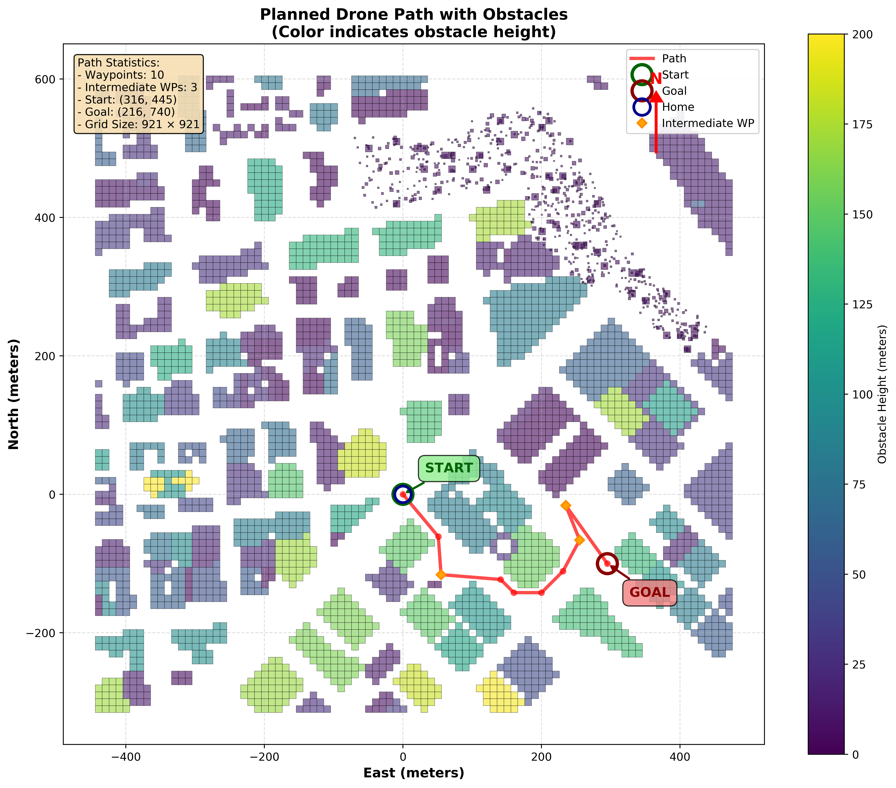
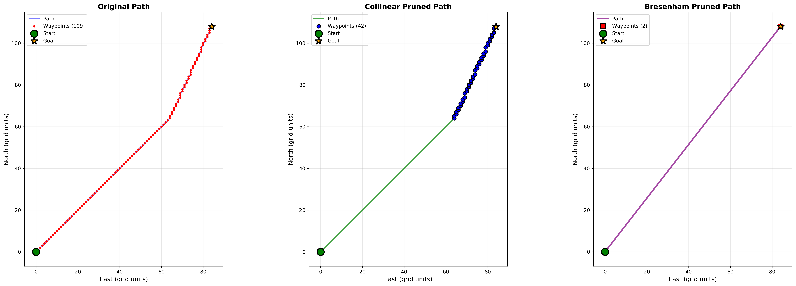

# My Solution to CS5491:HW1
**Before doing HW_1's questions, actually we need to complete the TODOs in raw project first.**
## Precondition(DONE)
1. Read lat0, lon0 from colliders.csv first line 第 122 行：从第一行读取 lat0、lon0 colliders.csv 
2. Set home position to (lon0, lat0, 0) 第 124 行：将起始位置设置为 （lon0， lat0， 0） 
3. Retrieve current global position 第 126 行：检索当前全局位置 
4. Convert to current local position using global_to_local() 第128 行：使用 global_to_local（） 转换为当前本地位置 
5. Convert start position to current position rather than map center  第 140 行：将起始位置转换为当前位置而不是地图中心 
6. Adapt to set goal as latitude/longitude position and convert 第 144 行：适应将目标设置为纬度/经度位置并转换 
7. Add diagonal motions with cost of sqrt(2) to A* implementation 第 147 行：将成本为 sqrt（2） 的对角线运动添加到 A* 实现中 
8. Prune path to minimize number of waypoints (e.g., collinearity test or Bresenham) 第 151 行：修剪路径以尽量减少航路点数量（例如，共线性测试或 Bresenham） 
9. Send waypoints to simulator for visualization 第 158 行：将航点发送到模拟器以进行可视化

## Question 4 (20 points): Implementing the iterative deepening A* search algorithm
You are expected to write an iterative deepening A* search algorithm in planning_utils.py named
iterative_astar(grid, h, start, goal) to help the drone plan routes. 
```python
python ../tests/test_performance_comparison.py
```
### Conclusion
**Adapt A\* rather than IDA\* for this project**. IDA suits memory-constrained environments* (e.g., embedded systems) due to its minimal memory footprint (O(path length)). 
It works better for short paths but may suffer from repeated shallow searches in longer ones.
- Large grids (>100k cells): A*
- Small grids (<100k cells): IDA*
- For colliders.csv creates a 921x921 grid = 848,241 cells, running iterative A* search:
  - A*: ~100 steps to find path
  - IDA*: 167+ iterations, still searching without result...

## Question 5 (20 points)
### 5.1 Implementing different heuristics for A*
In the current A* version in planning_utils.py, the Manhatten distance is used as the heuristic. You
are encouraged to propose one valid heuristic, implement that, and see how the planned routes
change.
```python
python ../tests/test_heuristics.py
```
#### Conclusion

| Heuristic  | Path Length  | Pruned Length | Cost    | Time (s)  |
|------------|---------|----|---------|---------|
| Euclidean  | 179     | 3  | 239.72  | 0.1371  |
| Manhattan  | 179     | 3  | 239.72  | 0.0031  |
| Diagonal   | 179     | 3  | 239.72  | 0.0757  |
| Chebyshev  | 179     | 3  | 239.72  | 0.1657  |

### 5.2 the Implementing A* search for traversing 3 fixed points
You are also required to set three fixed points in motion_planning.py which the drone has to traverse
before reaching to the destination. Building on this, you re-implement the A* search algorithm in
order to go through the 3 points.

#### Implement:See planning_utils.a_star_multi_waypoints()
1. Create a sequence of waypoints: start → wp1 → wp2 → wp3 → goal
2. Run A* search for each pair of consecutive waypoints(pruning for each pair)
3. Connect all path segments to form a complete path
4. Avoid repeating nodes at connection points

```python
python ../motion_planning.py
```
#### Notes:
1. setting fixed points: [Line 192]
    ```python
    intermediate_waypoints_grid = [
        (200, 500),  # Waypoint 1
        (250, 700),  # Waypoint 2
        (300, 680),  # Waypoint 3
    ]
    ```
2. Forbidden the fixed points:
    ```python
    USE_MULTI_WAYPOINT = False
    ```
3. I make a 2D-visualization, because of the simulator is too old and immutable(I guess had some bugs), the visualization of the 3D obstacle(Corresponding to the colliders.csv) is not accurate.
- usage: **after running motion_planning.py**, then run:
    ```python
    python ../visualize/visualize_path.py
    ```
- 2D illustration:
    

## Q&A
### 1. What is the relationship among the various modules in this project?
All the codes and docs are centered around these two files:
- motion_planning.py 
- planning_utils.py 
```
FCND-Motion-Planning
├─ backyard_flyer_solution.py [scene 1 test if run well]
├─ colliders.csv [obstacle data]
├─ docs [auxiliary doc by me]
│  ├─ mysolution.md
│  ├─ mysummary.md
│  └─ task.md
├─ misc [just some demo pics..]
│  ├─ double_helix.gif
│  └─ ....
├─ motion_planning.py [Part1 of the project]
├─ planning_utils.py  [Part2 of the project]
├─ tests [just some test cases]
│  ├─ ida_star_implementation.md
│  ├─ ...
│  └─ __init__.py
├─ visualize [visualize the obstacle map and the path]
│  ├─ visualize_colliders.py
│  ├─ visualize_path.py
│  └─ __init__.py
```
### 2. How to choose the pruning method for A* search?
**Bresenham is the best.** I did a comparison between collinearity and Bresenham pruning.


### 3. How to find points(start/goal/fixed) avoiding obstacles quickly?
Also, I had mapped the obstacle data to the 2D, you can run and click the plot then console will tell the clicked point's grid coordinate.
```python
python ../visualize/visualize_colliders.py
```